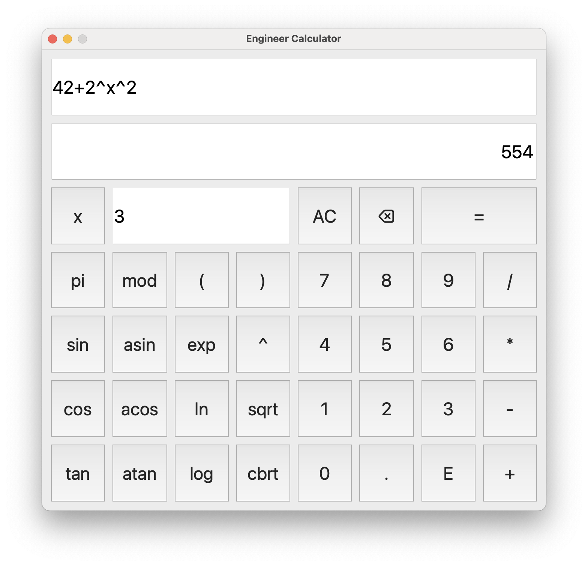
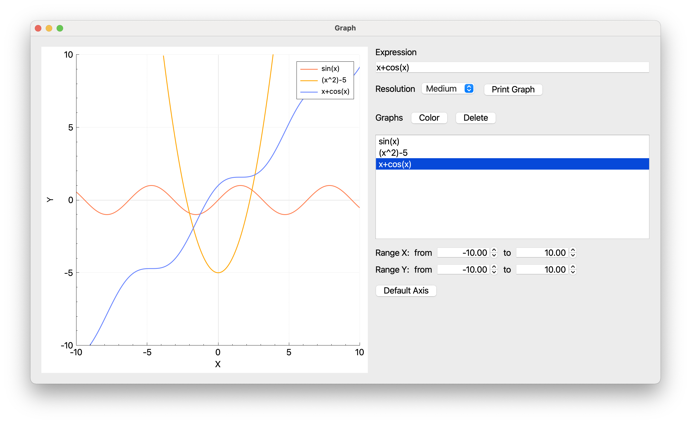
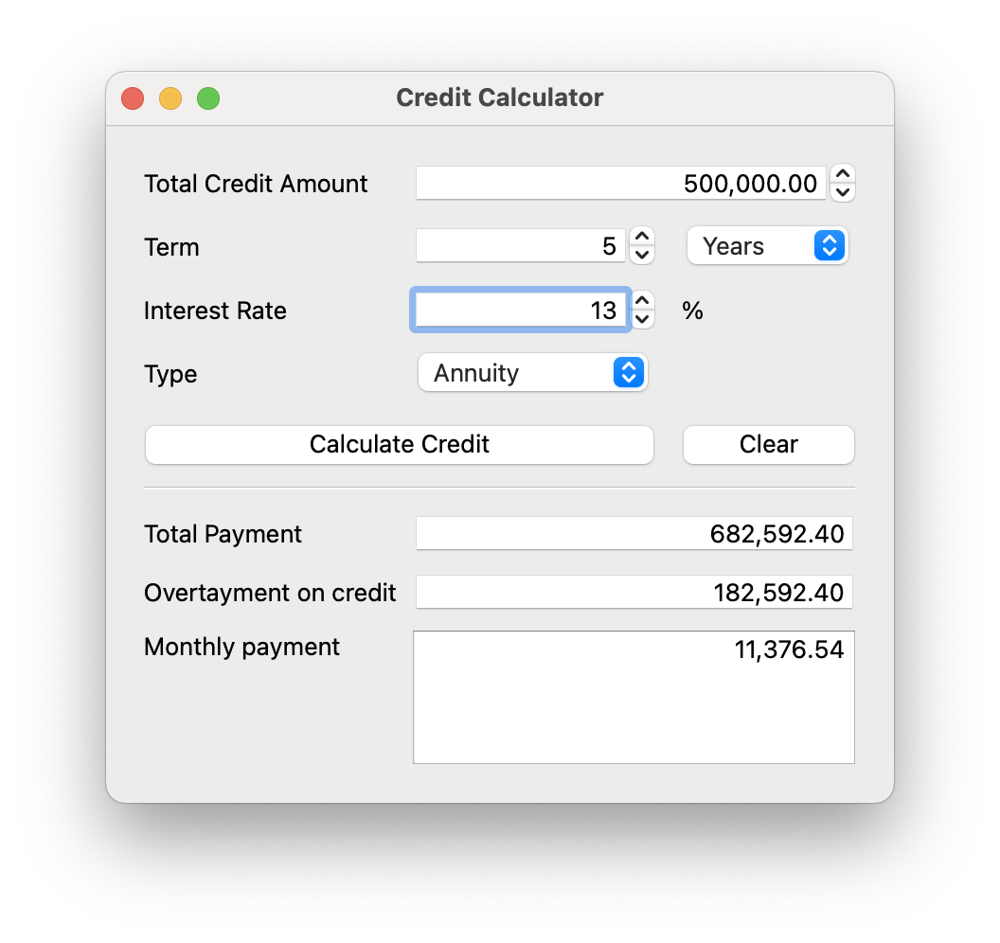
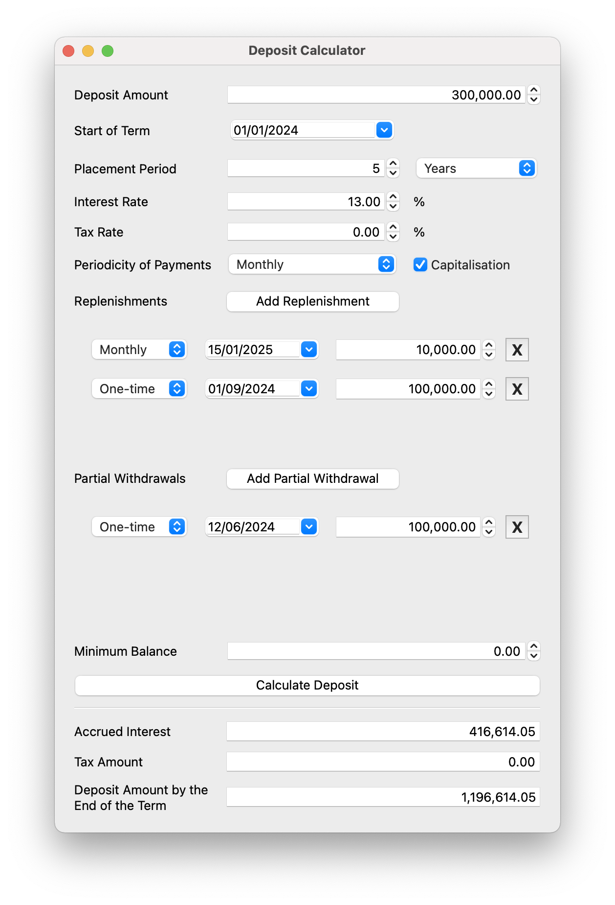

# SmartCalc
Engineer calculator with graph plot. Credit and debit calculator. GUI implementation, based on Qt library  for C++17.

## Table of Contents
- [Description](#description)
    - [Engineer Calculator](#engineer-calculator)
    - [Graph Plotting](#graph-plotting)
    - [Credit Calculator](#credit-calculator)
    - [Deposit Calculator](#deposit-calculator)
    - [Dependencies](#dependencies)
- [Getting Started](#getting-started)
    - [Dependenses](#dependencies)
    - [Installing](#installing)
    - [Usage](#usage)
- [Authors](#authors)
- [License](#license)
- [Acknowledgments](#acknowledgments)

## Description
- The program is developed in C++17 within the MyNamespace namespace.
- The code follows the Google Style guide.
- Full unit test coverage is prepared using the GTest library for expression calculation modules.
- The graphical interface implementation is based on the Qt library.
- The program is implemented using the MVC pattern.

### Engineer Calculator
- Accepts both integer and floating-point numbers as input.
- Input is done via keyboard and buttons in the application.
- Users can input up to 255 characters.
- Invalid input is allowed.
- Error will be displayed after pressing the = symbol for invalid input.
- Calculation is performed after complete input of the expression and pressing the = symbol.
- Supports the calculation of arbitrary bracketed arithmetic expressions in infix notation with the substitution of the variable x as a number.
- Supports various arithmetic operations and mathematical functions.

### Graph Plotting
- Supports plotting of functions defined using expressions in infix notation with the variable x.
- Requires specifying the displayed domain and range for plotting functions.
- Provides options to print, delete, and change the color of the graph.
- Supports a maximum of 8 graphs.

### Credit Calculator
- Supports annuity and differential types of credits.
- Allows calculation with specified loan amounts, interest rates, and terms.

### Deposit Calculator
- Supports calculation with specified deposit amounts, interest rates, terms, and additional options for withdrawal and addition of funds.

## Getting Started

### Dependencies

- MacOS, Linux
- C++17 compiler

### Installing

To build and install this project, please follow the instructions below:
1. Clone this repository to your local machine.
2. Open a terminal and navigate to the project directory.
3. Run: `make install`.
4. This command will compile the source code and create an executable file named "SmartCalc" in the build directory.

## Authors

## License

This project is licensed under the MIT License - see the [LICENSE](LICENSE.txt) file for details.

## Acknowledgments

Inspiration, code snippets, etc.
<!-- * [1-readme]()
* [2]
* [3]
* [4]
* [5] -->

© 2023 SergSinitsyn
